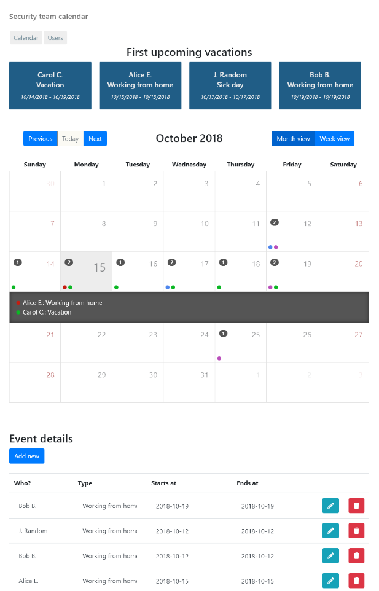

# TeamCalendar

TeamCalendar is an easy way to track your team's holidays, work from home days and other availabilities. It uses the MEAN stack.

This calendar comes with an accompanying Mattermost and Slack chatbot: https://github.com/wdvr/team-calendar-bot

This project was generated with [Angular CLI](https://github.com/angular/angular-cli) version 6.1.5.

The easiest way to run the project in debug mode (for development), is using docker. See Docker section below. It starts three containers, DB, backend and frontend, and reloads both backend and frontend on file changes. If you don't want to use docker, see the rest of this readme.

## Run with docker

Install docker, and docker-compose if necessary.

Run `docker-compose up` to start all three containers.

To add the team-calender-bot, uncomment the bot section of docker-compose.yml, and make sure 'context' points to the location of the source code for the calendarbot.

## Screenshot

## Instructions without docker

### Preparation

You will need to:

- install node.js
- install mongoD
- run `npm install`
- Change team name (title) in app.component.ts

### Development server

You will need 3 processes running:
- run `mongod` to start mongoDB
- run `node server.js` to run the server (api)
- run `ng serve` to start the client

Navigate to `http://localhost:4200/`. The app will automatically reload if you change any of the source files (client and server).

ports should be configured in environment.ts and environtment.prod.ts

### Build

Run `ng build` to build the project. The build artifacts will be stored in the `dist/` directory. Use the `--prod` flag for a production build.

## More

This calendar comes with an accompanying Mattermost and Slack chatbot (under development): https://github.com/wdvr/team-calendar-bot

## Further help

To report bugs or feature requests, use the issue tracker in Github. Pull requests welcome.
